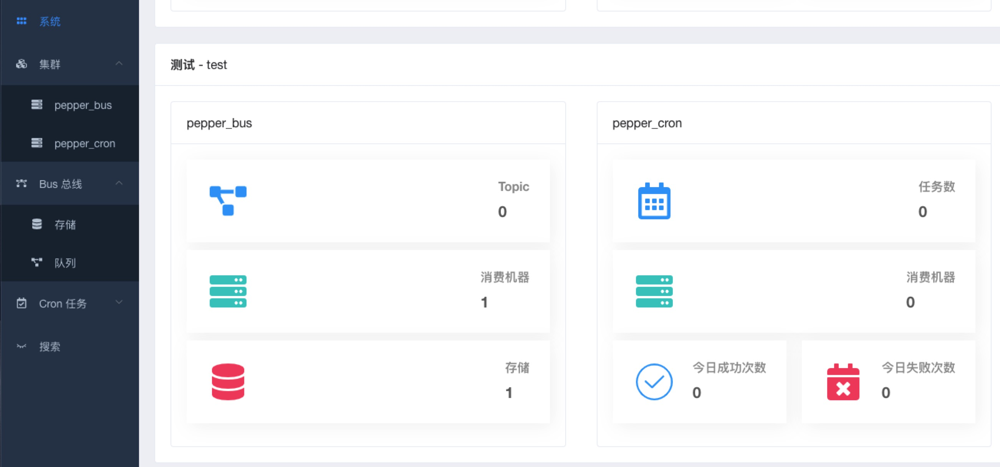
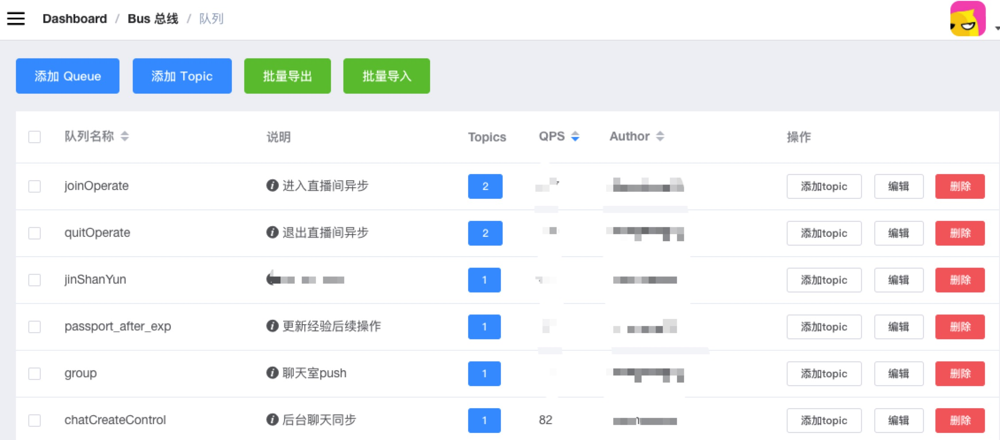
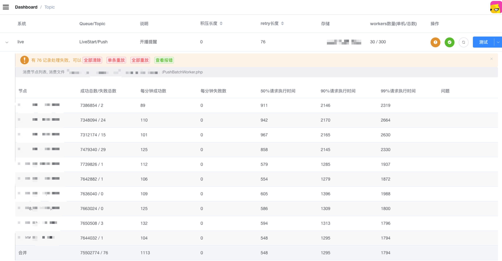
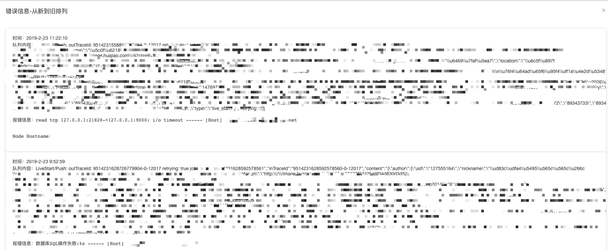
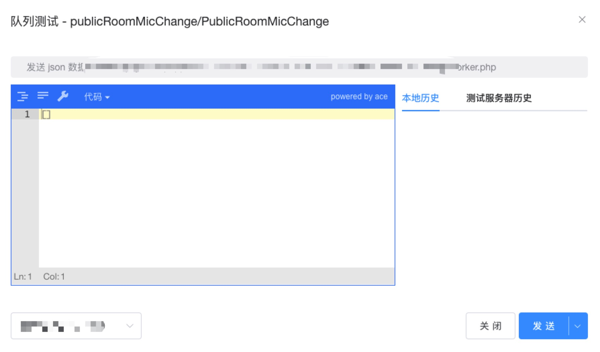
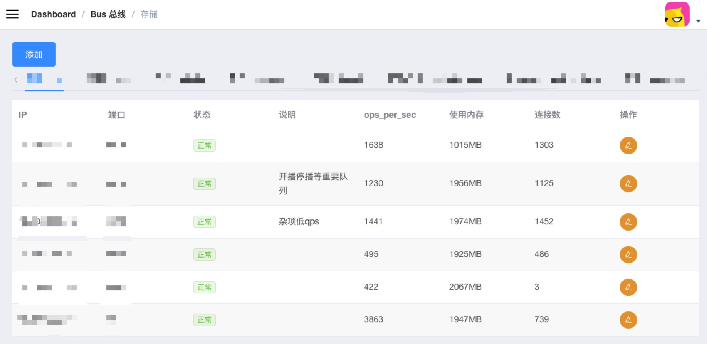

# Golang实践之花椒直播总线系统

  总线系统大家并不陌生，各个业务团队都有自己的数据流的处理策略，一般都是基于开源的，能提供队列数据结构的产品，进行包装构建。相比较传统业务，直播场景大型活动中洪峰流量较大，因此业务形态上有20%左右的处理，都采取了异步化。早期内部也有多套解决方案，队列存储部分有基于redis,nsq，kafka的。异步任务消费过程有cron消费，deamon消费，自研发的processWorker(使用php，基于父子进程方式，进行进程管理的工具)。子团队根据需要和技术栈选择和自行维护。如何针对各个业务线有一个统一的异步处理系统，是花椒系统研发团队需要面临的问题.
  
我们不是要造一个队里服务，而是要基于花椒现有的应用，提供一个统一的队列资源管理，运维，监控系统。并且针对不同技术栈的团队进行定制。提供统一友好的可视化服务。

目前服务上线以来，已经迁移和承接了花椒直播大部分的异步任务。由于整套服务由于依赖了一些自研发的根据内部场景定制的服务治理等工具，暂时没有对外开源。考虑在Gopher China之后进行开源。

## 需求分析
   1. 如何做到让公司的所有子系统，微服务中涉及的异步任务能够可衡量，可控制，使用成本低，科学扩容，并且扩容对业务透明。
   2. 如何让异步任务更方便调试，从加入，消费，处理，都能够显示的给出，出现的问题报错也能显示的说明。
   3. 能够让公司所有业务统一接入，统一管理，而不是分别构建很多子队列系统，分开运维，监控。
   4. 对PHP业务要友好，公司的主要线上队列服务使用php，用法是基于php的配置管理+进程管理框架（processWorker）+redis，能快速替换该方案，否则推广是一个问题。(当然现在java，golang也占一部分）

## Pepperbus设计
###基于以上需求，我们展开对总线队列的设计。
1. 首先存储选型，大趋势来说，肯定是插件化的，无论提供什么样底层存储，应用层提供统一接口。这一点设计上上很容易做到。
2. 第二，入口的通信协议，一定要对调用端友好，因为团队并不想花很多时间，去实现各个语言的总线sdk，所以入口协议我们选择了redis协议，无论长连接还是短连接，连接池，异常处理等细节在各种语言上已经很完备了，只需在逻辑层简单封装即可。既数据生产(add job)，采用redis协议。
3. 最后，最重要的就是任务管理，一种模式是开进程，消费总线使用的存储中的数据，过程计时打点，同时总线系统提供必要的进程管理功能(SDK).因为我并不想让业务接入各种数据打点的sdk，想从总线上直接获取第一手的数据采集，针对php的场景，很自然想到了，能否直接与fastcgi进行通信，通信的响应时间，其实就是对于任务的处理时间，同时基于这种方式，可以直接享受到php-fpm可以动态的更新代码的红利。我们异步任务的脚本，也能平滑动态进行更新。当然后期针对fpm的数据转发和通信，包括php-fpm和脚本各种执行时间的配置，我们有过不少的挫折，但后来都迎刃而解。团队之前本身也是负责360的长连接相关技术，对于网络的处理还是有一定的经验的~ 
5. 最后就是针对其他语言，直接提供http接口的任务转发。这样一来，方便debug这一条需求也能覆盖住，其实后续所有的异步任务，对于订阅者来说，都是从post请求等获取，理论上本地可以通过curl命令调试异步任务。当然我们提供了一个丰富的dashboard可以完成这个工作，并且测试环境可以获取历史数据，进行重放，减少大家构建请求的时间。
6. **业务驱动的Dashboard，队列增删查改，trouble shooting，重放，报警，监控。重新封装一套总线服务的目的，就是要解决业务痛点，最大程度的减少使用复杂度，提供更多有意义的信息。项目成功这一非硬核技术环节很重要。要好用，要好用，要好用。**

## PepperBus Features
### 基于上面的设计，最终总线特征如下:
- 支持redis协议作为总线数据输入，充分利用业务端成熟的redis扩展，对业务端友好，迁移和改造成本低
- 通过fastcgi协议与后端通信，与实际的业务逻辑解耦，方便的支持php和golang等多种语言接入
- 数据的输入和输出对于长连接友好，解决LNMP解决方案，长连接情况下，由于集群连接过多给后端服务造成压力，通过代理方式与最终的后端服务做连接复用，对输入不限制长连，对输出维持有限长连接
- 总线队列支持常规的生产者和消费者模式，消息可以按订阅关系重复消费
- 全链路监控策略，可以获取流水线作业的操作序列，完整自描述其关系
- 队列拥塞状态监控，通过与消费者协议交互，反馈处理异常的队列，计算队列消费者处理能力，动态扩容消费进程
- 总线支持定时任务的设置和管理，动态控制和迁移定时任务，解决常规的crontab的管理问题
- 总线队列支持平滑重启，平稳恢复所有任务

## 系统架构图

### 架构描述
1. 业务服务器可以与bus总线实例混合部署也可以独立部署，混合部署时可以优先访问本地总线服务器，独立分离部署可以与总线服务用域名进行通信
2. 总线服务器与php-fpm交互可以通过本地也可以通过网络

### 业务处理流程图说明
1. 业务服务器将任务加入到总线服务
2. 总线服务存储任务到存储
3. 将总线任务传输给cgi进程
4. cgi进程返回处理结果
5. 总线移除处理任务
- 业务服务器可以与bus总线实例混合部署也可以独立部署，混合部署时可以优先访问本地总线服务器，独立分离部署可以与总线服务用域名进行通信
- 总线服务器与php-fpm交互可以通过本地也可以通过网络
- 总体架构图：

###整体架构图
### 调用部署

## 项目依赖的其他组件

- dashboard: 提供用户管理的web ui。
- gokeeper: 提供配置管理服务。

## 用户使用演示
用户使用演示

1. 后台整体情况，可以按系统进行区分

2. 队列列表管理
 
3. 队列实时监控，可以进行重放清理等设定，新版已经支持灰度重放等。同时会实时显示请求延时，如图:第一列90%的请求在2146ms内完成。
 
4. 显示错误日志查看，可以定位到具体消息id，如果php报错，也会正常展示。
 
5. 方便的测试dashboard，可以将测试历史数据和本地保存的线上历史数据，直接加入bus，拿到异步处理结果

6. 对集群使用的存储进行监控(目前支持pika和redis)，扩容对业务透明

