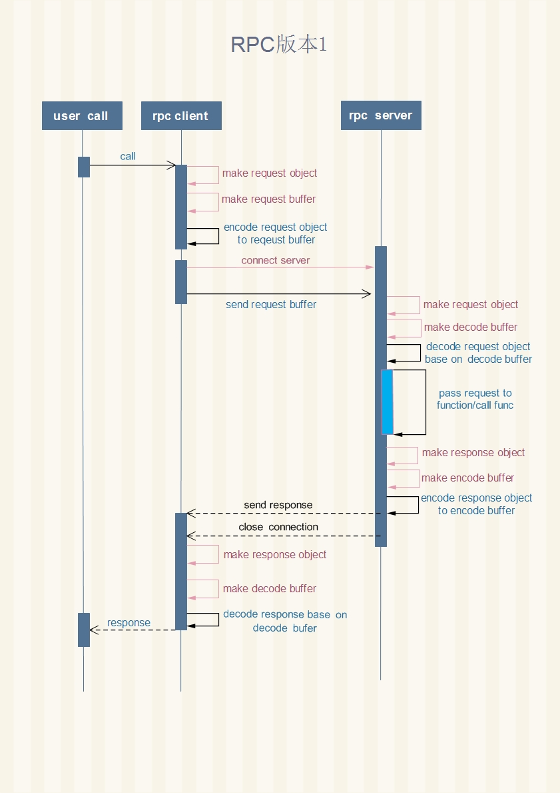
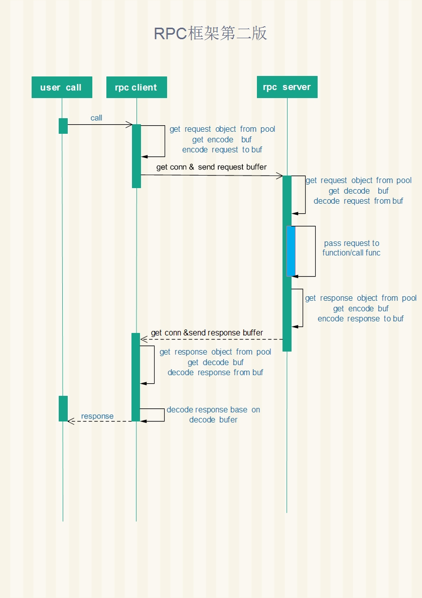
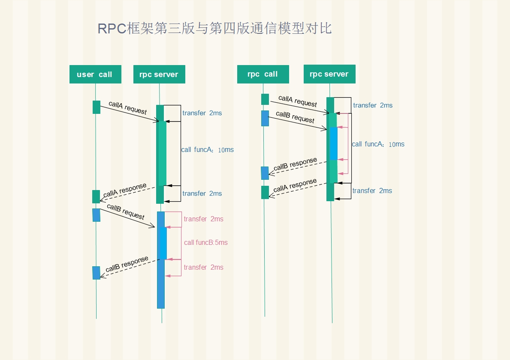

360消息系统RPC基础库迭代
---
引文：
=============================

        消息系统内部各服务的通信，是依赖于RPC调用串联起来的。RPC框架的易用性，性能，开销决定了整个系统的开发的灵活性，整体性能
        和负载上限。因此对于这样一个基础库，硬性要求一定是稳定高效易用的，一旦整个系统使用，除非必要不做影响应用层的修改。
        但由于项目在启动时，go语言本身还没有成型的开源方案，先后开发3个版本，才完善成型。

        消息系统的rpc框架的迭代，可以说是系统通信模型设计的一个缩影，走完了能走的弯路。。。（填坑）他的起点或者说设计思路，就是
        简单易用，迅速迭代完成系统原型。它在上线初期很好的完成了使命，但后期随之而来的并发通信压力，业务级别的策略已经无法改善
        通信瓶颈,必须对底层通信库做彻底改造，并升级系统服务所有接口到新通信框架。下面来谈谈具体迭代过程。

浅谈rpc
----------------------------------------------
    
        一个RPC库的设计（基于TCP），牵扯到几个基本的概念：用户调用，传输编码，信道利用。
        用户调用：
            按过程分为：调用者发起请求（call），等待远端完成工作，获取对端响应，三个过程。
        根据调用方式还可分为：  
            同步调用：发送请求，等待结果，结果返回调用方。
            异步调用：发送请求，用户立刻拿到请求handler，通信和调用交给底层框架处理，用户可以处理其他逻辑，再通过之前返回
            handler来直接获取处理结果。同步通知：发送请求，数据送达到对方，无需等待结果，返回ack response到调用方，释放同步
            请求。
        传输编码：
            即对用户的请求request与服务端的响应response做encode与decode。即将请求数据结构，与响应数据结构序列化后在网络中总
            传输。比如常见的protobuf，msgPack，bson，json，xml,gob等。如果要对编解码分类，可能分为文本型和二进制型，比如
            json，xml这些属于文本型，其他几种属于二进制型。在编码方式实现上，同一种编码在实现效率上可能有区别，我们消息系统主
            要使用了go语言原生的gob编码（相比较网络io，编码效率与业务层易用性权衡下的选择）。具体编码的选择上，因项目而异，对
            于rpc通信框架来说，只关心编解码实现过程中牵扯到与rpc框架交互的接口。牵扯到两个相关于性能的细节：内存复用，与对象
            复用。
        信道利用：
            对于一个基于tcp的框架，主要牵扯两个问题，一个是长短连接，连接复用策略，与连接管理。
        
        了解了以上概念，剩下问题，就是如何根据用户的调用方式，编解码库实现方式，和信道利用上，最大限度提高效率。

早期RPC框架
-----------------------------------------------------
        早期的消息系统，使用的策略是：
            同步调用+短连接+动态创建所有buffer+动态创建所有对象

        这种方式，在初期很快的完成了原型，并且在项目初期，通信比较少情况下，稳定跑了近半年时间。
        
        通信时序图如下：

 

        随着业务放量，推送使用频率的增长，业务逻辑的复杂。瓶颈出现，100w连，稳定服务后，virt 50G，res 40G，左右。gc时间一
        度达到3~6s，整个系统负载也比较高。(12年，1.0.3版本)
        
        其实早期在实现的时候，选择动态创建buffer和object，也不奇怪，主要是考虑到go在runtime已经实现了tcmalloc，并且我们相
        信它效率很高，无需在应用层实现缓存和对象池，但实际上由于在通信繁忙时候，这种实现方式，给通信端口，语言的造成很大压力
        ，并且使用短连接，每次对内服务，都重新创建连接开销也很大，pprof时候可以看到，除了应用层建立大量对象和buffer外，go
        的tcp底层创建tcpConnection也会动态创建大量对象，具体瓶颈在newfd操作，非常明显。

RPC通信框架第一次迭代
--------------------------------------------------

        针对这种情况，我对通信库做了第一次迭代改造。
        
        1.使用长连接代替短连接，对每一个远端server的address提供一个连接池，用户调用，从连接池中获取连接，对应下图中get conn
        环节。用户的一次request和response请求获取后，将连接放入连接池，供其他用户调用使用。因此系统中能并行处理请求的数量，
        在调度器不繁忙的情况下，取决于连接池内连接数量。假设用户请求一次往返加服务端处理时间，需要消耗10ms，连接池内有100个
        连接，那每秒钟针对一个server的qps为1w qps。这是一个理解想情况。实际上受server端处理能力影响，响应时间不一定是平均的，
        网络状况也可能发生抖动。这个数据为后面讨论pipeline做准备。

        2.对连接绑定buffer，这里需要两个buffer，一个用于解码（decode），从socket读缓冲获取的数据放入decode buffer，用户对读
        到的数据进行解码，即反序列化成应用层数据结构。一个用户编码（encode），即对用户调用传入的所有参数进行编码操作，通过这
        个缓冲区，缓存编码后的一个完整序列化数据包，再将数据包写入socket 写缓冲。

        3.使用object池，对编解码期间产生的中间数据结构进行重复利用，注意这里并不是对用户传递的参数进行复用，因为这个是由调用
        用户进行维护的，底层通信框架无法清楚知道，该数据在传输后是否能够释放。尤其在使用pipeline情况下，中间层数据结构也占了
        通信传输动态创建对象的一大部分。
        
        改动后，通信图如下，上图中红线所带来的开销已经去除，换成各种粒度的连接池和部分数据结构的对象池。具体细节，后面说明
        手机助手gorpc框架时候，说明。
        
        rpc框架第二版使用策略：
                同步调用+连接池+单连接复用编解码buffer +复用部分对象

 
                    
        这种方式，无疑大大提高了传输能力，另外解决了在重启等极限情况下，内部通信端口瞬时会有耗尽问题。内存从最高res 40G下降
        到20G左右。gc时间也减少3倍左右。这个版本在线上稳定服务了接近一年。

RPC通信框架二次迭代
---------------------------------------

        但这种方式对连接的利用率并不高，举例说明，用户调用到达后，从连接池获取连接，调用完成后，将连接放回，这期间，这个连接
        是无法复用的。

        设想在连接数量有限情况下，由于个别请求的服务端处理延时较大，连接必须等待用户调用的响应后，才能回放到连接池中给其他请
        求复用。用户调用从连接池中获取连接，发送request，服务端处理10ms,服务端发送response，假设一共耗时14ms，那这14ms中，
        连接上传输数据只有4ms，同一方向上传输数据只有2m，大部分时间链路上都是没有数据传输的。

        但这种方式也是大多目前开源软件使用的长连接复用方案，并没有充分利用tcp的全双工特性，通信的两端同时只有一方在做读写。
        这样设计好处是client逻辑很简单，传输的数据很纯粹，没有附加的标记。在连接池开足够大的情况下，网络状况良好，用户请求
        处理开销时长平均，这几个条件都满足情况下，也可以将server端的qps发挥到极限（吃满cpu）。

        另一种方案，是使整个框架支持pipeline操作，做法是对用户请求进行编号，这里我们称做sequence id，从一个连接上发送的所有
        request，都是有不同id的，并且client需要维护一个请求id与用户调用handler做对应关系。服务端在处理数据后，将request所带
        的请求的sequence id写入对应请求的response，并通过同一条连接写回。client端拿到带序号的response后，从这个连接上找到之
        前该序号对应的用户调用handler，解除用户的阻塞请求，将response返回给request的调用方。

        对比上面说的两个方案，第二个方案明显麻烦许多。当你集群处于中小规模时候，开足够的连接池使用第一种方案是没问题的。问题
        是当你系统中有几百个上千个实例进行通信的时候，对于一个tcp通信框架，会对几百个甚至上千个需要通信的实例建立连接，每个
        目标开50个到100个连接，相乘后，整个连接池的开销都是巨大的。而rpc请求的耗时对于通信框架是透明的，肯定会有耗时的请求，
        阻塞连接池中的连接，针对这种情况调用者可以针对业务逻辑做策略，不同耗时接口的业务开不同的rpc实例。但在尽量少加策略的情况
        下，使用pipline更能发挥连接的通信效率。

        pipeline版本的rpc库，还加入了其他设计和考虑，这里只在最基础的设计功能，进行了讨论，下图是，第三版本rpc库，对比版本二的
        不同。

 

        如上图所示，两次rpc调用可以充分利用tcp全双工特性，在14ms内，完成2次tcp请求。在server端处理能力非饱和环境下，用户调用
        在连接池的利用上提高一个量级，充分利用tcp全双工特性，让连接保持持续活跃。其目的是可以用最少的连接实现最大程度并发，
        在集群组件tcp互联通信的情况下，减少因为请求阻塞造成的连接信道浪费。

以上对消息系统rpc通信框架的迭代和演进进行了说明。只是对通信过程中基础环节和模型做了粗线条介绍。第三版本的rpc通信框架，其实为
了适应分布式系统下的需求，需要辅助其他功能设计。每个细节都决定这个库能否在中大规模分布式环境中下是否试用，或者说是否可控，我们
将在下一章里面详细介绍。

